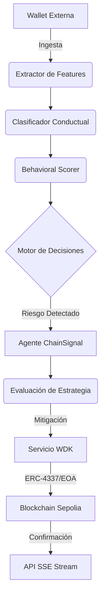
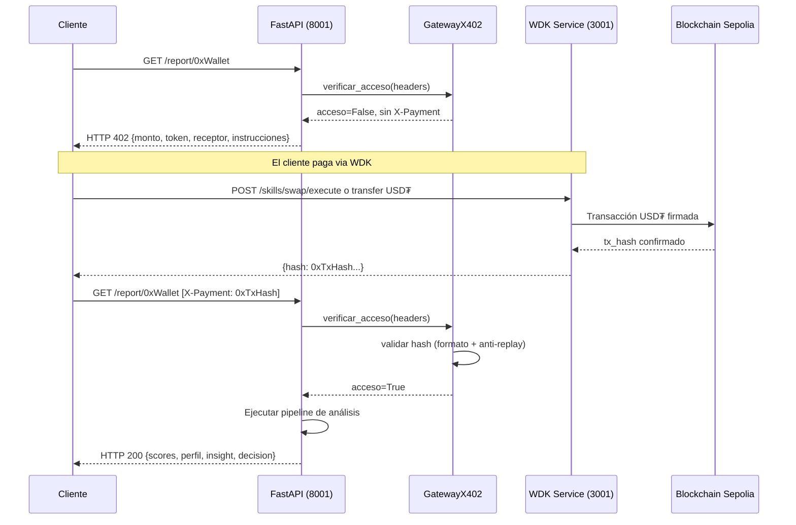

# Arquitectura Técnica del Sistema ChainSignal

ChainSignal es un sistema de orquestación financiera autónoma que integra análisis predictivo de comportamiento on-chain con ejecución directa mediante el Tether Wallet Development Kit (WDK). Este documento detalla la topología de componentes y el flujo de datos del sistema.

## 1. Topología de Componentes

El ecosistema se divide en cuatro capas funcionales de alta cohesión y bajo acoplamiento:

### A. Capa de Interfaz y API (Python/FastAPI)
- **Responsabilidad**: Gestión de endpoints REST y streaming vía Server-Sent Events (SSE).
- **Componentes**: `api/main.py`.
- **Funcionalidad**: Orquesta las solicitudes de análisis y expone el progreso del agente en tiempo real.

### B. Capa de Inteligencia y Decisión (Python/OpenClaw opcional)
- **Responsabilidad**: Análisis heurístico y determinista de datos blockchain.
- **Componentes**:
    - `generacion_features/`: Extracción de métricas crudas desde Etherscan.
    - `perfil_wallet/`: Clasificación conductual (Whale, DeFi Power User, Bot, etc.).
    - `decision_engine/`: Motor de lógica para determinar el nivel de intervención (MONITOR, EXECUTE_BASIC, EXECUTE_ADVANCED).
- **Tecnología**: Integración con LLMs para interpretación narrativa y generación de código Solidity.

### C. Capa de Orquestación de Agente (Python)
- **Responsabilidad**: Gestión del ciclo de vida de operaciones on-chain.
- **Componentes**:
    - `agents/agente_chainsignal.py`: Orquestador principal.
    - `strategy/`: Lógica de mitigación (Swaps a USD₮, protección de balance).
    - `contract_generator/`: Generación y compilación dinámica de scripts de control.

### D. Capa de Ejecución y Puerta de Enlace (Node.js/Tether WDK)
- **Responsabilidad**: Firma de transacciones y comunicación con la red Ethereum.
- **Componentes**: `wdk_service/server.js`.
- **Integraciones**:
    - **Tether WDK**: Autocustodia y manejo de activos.
    - **ERC-4337**: Soporte de Account Abstraction para transacciones delegadas y gasless.
    - **Velora**: Ejecución de intercambios de activos nativos por USD₮.

## 2. Flujo de Ejecución del Pipeline

## 3. Gestión de Microservicios

El sistema opera bajo una configuración de microservicios contenida en Docker:

-   **API de Inteligencia (8001)**: Nodo central de procesamiento.
-   **Servicio WDK (3001)**: Gateway crítico para la interacción on-chain.
-   **Frontend Web (8080)**: Visualización y monitoreo de operaciones.

## 4. Estrategia de Mitigación de Riesgo

ChainSignal prioriza la preservación de capital en **USD₮**. Ante la detección de un score de riesgo superior al umbral configurado (ej. > 80), el agente ejecuta un flujo de emergencia:

1.  **Cotización (Quote)**: Consulta de tasa de cambio vía Velora WDK.
2.  **Swap Estratégico**: Intercambio de activos de alta volatilidad por USD₮.
3.  **Habilitación de AA**: Uso de Smart Accounts (ERC-4337) si el balance nativo del agente es insuficiente para cubrir el gas de la operación.
4.  **Despliegue de Gating x402**: Aplicación de licencias de acceso sobre los reportes generados (ver Sección 5).

---

## 5. Flujo x402 — Monetización de Reportes

El protocolo x402 protege el endpoint `GET /report/{wallet_address}`. Cada reporte de análisis conductual es un recurso de pago: el sistema emite un desafío HTTP 402, el cliente paga en **USD₮** via el WDK, y presenta el comprobante para obtener el reporte completo.

### Componentes involucrados

-   **`services/servicio_x402.py`**: Módulo central con `ValidadorX402`, `GatewayX402` y `ChallengeX402`.
-   **`api/main.py` → `/report/{wallet}`**: Endpoint protegido que orquesta el flujo.
-   **`wdk_service/server.js`**: Gateway de pago que firma la transacción en USD₮.

### Diagrama de secuencia

### Variables de entorno requeridas

| Variable | Descripción | Ejemplo |
|---|---|---|
| `X402_ENABLED` | Habilita/deshabilita el acceso protegido | `true` |
| `X402_PAYMENT_RECIPIENT` | Dirección que recibe el pago | `0x...` |
| `X402_REPORT_PRICE_USDT` | Precio del reporte en USDT (unidades enteras) | `1` |

### Degradación ante falla

Si `X402_ENABLED=false`, el endpoint retorna `HTTP 503` con un mensaje descriptivo. El sistema **no crashea** ni devuelve datos sin autorización.

