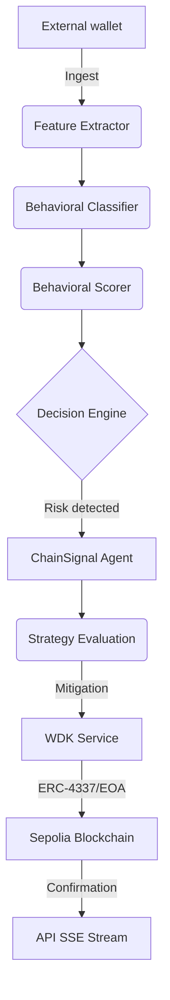
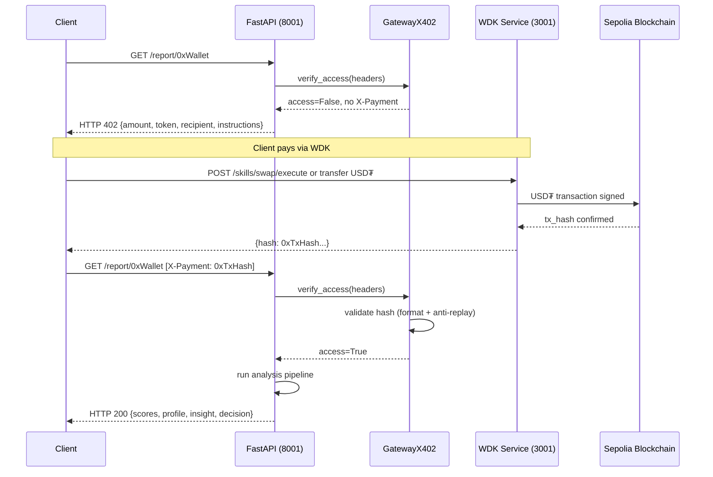

# ChainSignal Technical Architecture

ChainSignal is an autonomous financial orchestration system that integrates on-chain behavioral analysis with direct execution via the Tether Wallet Development Kit (WDK). This document details the component topology and data flow.

## 1. Component Topology

The ecosystem is split into four functional layers with high cohesion and low coupling:

### A. Interface and API Layer (Python/FastAPI)
- **Responsibility**: Manage REST endpoints and streaming via Server-Sent Events (SSE).
- **Components**: `api/main.py`.
- **Functionality**: Orchestrates analysis requests and exposes agent progress in real-time.

### B. Intelligence and Decision Layer (Python/OpenClaw optional)
- **Responsibility**: Heuristic and deterministic analysis of blockchain data.
- **Components**:
    - `generacion_features/`: Extract raw metrics from Etherscan.
    - `perfil_wallet/`: Behavioral classification (Whale, DeFi Power User, Bot, etc.).
    - `decision_engine/`: Logic engine for intervention level (MONITOR, EXECUTE_BASIC, EXECUTE_ADVANCED).
- **Technology**: Optional LLM integration for narrative interpretation and Solidity code generation.

### C. Agent Orchestration Layer (Python)
- **Responsibility**: Manage lifecycle of on-chain operations.
- **Components**:
    - `agents/agente_chainsignal.py`: Main orchestrator.
    - `strategy/`: Mitigation logic (USD₮ swaps, balance protection).
    - `contract_generator/`: Dynamic generation and compilation of control scripts.

### D. Execution Gateway Layer (Node.js/Tether WDK)
- **Responsibility**: Sign transactions and interact with Ethereum network.
- **Components**: `wdk_service/server.js`.
- **Integrations**:
    - **Tether WDK**: Self-custody and asset management.
    - **ERC-4337**: Account Abstraction support for delegated and gasless transactions.
    - **Velora**: Native asset swap execution to USD₮.

## 2. Pipeline Execution Flow

## 3. Microservice Management

The system operates under a Docker microservice configuration:

- **Intelligence API (8001)**: Core processing node.
- **WDK Service (3001)**: Critical gateway for on-chain interaction.
- **Web Frontend (8080)**: Visualization and operation monitoring.

## 4. Risk Mitigation Strategy

ChainSignal prioritizes preserving capital in USD₮. When risk exceeds configured threshold (e.g. > 80), the agent executes an emergency flow:

1. **Quote**: Query exchange rate via Velora WDK.
2. **Strategic Swap**: Convert high-volatility assets to USD₮.
3. **AA Enablement**: Use Smart Accounts (ERC-4337) if agent native balance is insufficient for gas.
4. **x402 Gate**: Apply access licenses to generated reports.

## 5. x402 Report Monetization Flow

The x402 protocol protects `GET /report/{wallet_address}`. Each behavioral report is a paid resource: API returns HTTP 402 challenge, client pays in USD₮ via WDK, then presents proof to receive the report.

### Involved Components

- **`services/servicio_x402.py`**: Validator and gateway logic.
- **`api/main.py` → `/report/{wallet}`**: Protected endpoint orchestration.
- **`wdk_service/server.js`**: Payment gateway for transaction signing.

### Sequence Diagram

### Required Env Variables

| Variable | Description | Example |
|---|---|---|
| `X402_ENABLED` | Enables/disables protected access | `true` |
| `X402_PAYMENT_RECIPIENT` | Recipient address for payment | `0x...` |
| `X402_REPORT_PRICE_USDT` | Report price in USDT | `1` |

### Failure Degradation

If `X402_ENABLED=false`, endpoint returns HTTP 503 with descriptive message. System does not crash or leak data.
