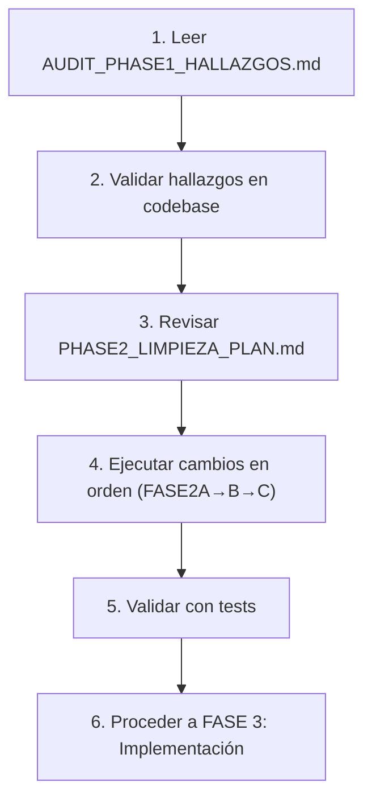

# 📋 AUDITORÍA CHAINSIGNAL - ÍNDICE DE DOCUMENTOS

**Estado Actual:** Fase 2 Completada (Auditoría + Plan)  
**Próximo:** Fase 3 (Implementación de Limpieza)  
**Última Actualización:** Sesión Actual

---

## 📚 Documentos de Fase 1: Análisis

### 1. [AUDIT_REPORT.md](AUDIT_REPORT.md)
**Contenido:** Auditoría original del sistema x402 y validación de pagos  
**Enfoque:** 
- Descubrimiento de simulación mode silent
- Validación RPC y anti-replay
- Race conditions en file locking  
**Relevancia:** Fase anterior (completada)  
**Estado:** ✅ Implementado (simulation_mode flag + file locking)

---

## 📚 Documentos de Fase 2: Código Cleanup

### 2. **AUDIT_PHASE1_HALLAZGOS.md** ← YOU ARE HERE
**Contenido:** Auditoría exhaustiva de calidad de código  
**Hallazgos:**
- 4 CRÍTICOS (USDT mainnet, endpoints duplicados, hardcodes, archivos muertos)
- 13 ALTOS (manager y configuración dispersa)
- 20 MODERADOS (deuda técnica, inconsistencias)
- 10 MENORES (limpieza y documentación)

**Secciones:**
1. Resumen ejecutivo (tabla)
2. Análisis por hallazgo (CRÍTICO → MENOR)
3. Clasificación por módulo
4. Matriz de impacto
5. Búsquedas ejecutadas (evidencia)

**Próximo Paso:** Revisar y validar hallazgos

---

### 3. [PHASE2_LIMPIEZA_PLAN.md](PHASE2_LIMPIEZA_PLAN.md)
**Contenido:** Plan de acción para remediar todos los hallazgos  
**Estructura:**
- 6 bloques de trabajo independientes
- Riesgo (LOW/MEDIUM/HIGH) para cada uno
- Orden de ejecución con dependencias
- Validación strategy para cada cambio
- Checklist GO/NO-GO

**Bloques:**
1. Eliminar código muerto (4 archivos)
2. Fix USDT Mainnet → Sepolia (CRÍTICO)
3. Consolidar montos swap (3 ubicaciones → 1 config)
4. Remover time.sleep artificial (performance)
5. Normalizar SSE estados/pasos (standardization)
6. Centralizar todos los configs

**Recomendación:** Seguir orden FASE2A → 2B → 2C

---

## 📚 Documentos Anteriores (PEFASE 1)

### 4. [SIMULATION_MODE.md](SIMULATION_MODE.md)
**Contenido:** Guía de operación del modo simulación  
**Propósito:**
- Explicar cuándo está activo
- Cómo reconocerlo (simulation_mode flag)
- Cómo cambiar a producción
**Estado:** ✅ Activo (implementado en FASE 1)

---

### 5. [DOCUMENTATION_INDEX.md](DOCUMENTATION_INDEX.md)
**Contenido:** Índice original del proyecto  
**Estado:** Archivo de referencia

---

## 🎯 CÓMO USAR ESTOS DOCUMENTOS

### Para Developers:


### Para Project Managers:
1. ✓ Leer resumen ejecutivo de AUDIT_PHASE1_HALLAZGOS.md
2. ✓ Revisar matriz de impacto
3. ✓ Confirmar orden de PHASE2_LIMPIEZA_PLAN.md
4. ✓ Asignar recursos según riesgo
5. ✓ Timeline: ~3-4 horas para todas las fases

### Para DevOps:
1. ✓ Preparar ambiente de testeo
2. ✓ Verificar USDT_SEPOLIA disponible en Sepolia
3. ✓ Confirmar WDK está accesible
4. ✓ Backup de .env antes de cambios
5. ✓ Rollback plan en PHASE2_LIMPIEZA_PLAN.md

---

## 📊 ESTADÍSTICAS

### Hallazgos por Severidad:
- **CRÍTICO:** 4 (bloquean funcionalidad)
- **ALTO:** 13 (mantenibilidad)
- **MODERADO:** 20 (deuda técnica)
- **MENOR:** 10 (limpieza)
- **TOTAL:** 47

### Archivos Afectados:
- api/main.py (4 problemas)
- agents/agente_chainsignal.py (4 problemas)
- strategy/estrategia_proteccion_wallet.py (1 como copy de agents)
- services/ (2 módulos con 3+ problemas cada)
- web_app/ (2-3 problemas)
- Raíz (4 archivos temporales)

### Bloques de Trabajo Fase 2:
- Tiempo Estimado:
  - TRABAJO 1: 5 min
  - TRABAJO 4: 5 min
  - TRABAJO 3: 20 min
  - TRABAJO 2: 15 min
  - TRABAJO 6: 30 min
  - TRABAJO 5: 45 min
  - **TOTAL: ~2 horas + testing**

---

## 🔄 FLUJO DE FASES

```
┌─ FASE 1 ─────────────────────────────────┐
│ x402 Simulator Mode Audit                 │
│ ✓ COMPLETADA & IMPLEMENTADA              │
│                                           │
│ Documentos:                               │
│ - AUDIT_REPORT.md                         │
│ - SIMULATION_MODE.md                      │
│ - IMPLEMENTATION_SUMMARY.md               │
└───────────────────────────────────────────┘
        ↓

┌─ FASE 2 (ACTUAL) ────────────────────────┐
│ Code Cleanup & Quality Audit              │
│ ✓ AUDITORÍA COMPLETA (Fase 2.1)          │
│ → PLAN COMPLETADO (Fase 2.2)             │
│ ⧐ IMPLEMENTACIÓN PENDIENTE (Fase 2.3)    │
│                                           │
│ Documentos:                               │
│ - AUDIT_PHASE1_HALLAZGOS.md ← AQUÍ       │
│ - PHASE2_LIMPIEZA_PLAN.md                │
│ - (Fase 2.3: Cambios de código)          │
└───────────────────────────────────────────┘
        ↓

┌─ FASE 3-8 (FUTUROS) ─────────────────────┐
│ 3: Eliminación             (20 min)       │
│ 4: Backend Normalization   (30 min)       │
│ 5: Payment Normalization   (20 min)       │
│ 6: UI Normalization        (30 min)       │
│ 7: Final Validation        (40 min)       │
│ 8: Output Delivery         (20 min)       │
│                                           │
│ Documentación:                            │
│ - Cambios de código por fase              │
│ - Diffs antes/después                     │
│ - Verificación checklist                  │
└───────────────────────────────────────────┘
```

---

## ✅ ESTADO DE TAREAS

### Fase 2.1: Auditoría Exhaustiva
- ✅ Búsqueda de código muerto completada
- ✅ Análisis de hardcodes completado
- ✅ SSE event flow mapeado
- ✅ Dependencias identificadas
- ✅ Documento AUDIT_PHASE1_HALLAZGOS.md generado

### Fase 2.2: Plan de Limpieza
- ✅ Estrategia para cada hallazgo definida
- ✅ Orden de ejecución determinado
- ✅ Riesgos identificados y mitigados
- ✅ Validación strategy para cada cambio
- ✅ Documento PHASE2_LIMPIEZA_PLAN.md generado

### Fase 2.3: Implementación (SIGUIENTE - 3 OPCIONES)

**OPCIÓN A: Ejecución Rápida (Low Risk)**
- Eliminar 4 archivos temporales
- Quitar time.sleep (1 línea)
- Tiempo: 10 minutos
- Validación: Rápida

**OPCIÓN B: Ejecución Integral (Medium Risk)**
- Todas las de OPCIÓN A
- + Centralizar config
- + Fix USDT address
- + Consolidar montos
- Tiempo: 1.5 horas
- Validación: Exhaustiva (tests + manual)

**OPCIÓN C: Ejecución Completa (High Risk - Semana)**
- Todo lo anterior
- + SSE standardization (refactor largo)
- + Frontend updates
- + Backward compatibility testing
- Tiempo: 4+ horas
- Validación: Testing completo end-to-end

---

## 📞 PRÓXIMOS PASOS

1. **Revisión:** Validar hallazgos con equipo de desarrollo
2. **Decisión:** Elegir OPCIÓN A, B o C (tiempo + riesgo)
3. **Aprobación:** Sign-off en checklist GO/NO-GO
4. **Ejecución:** Proceder a Fase 2.3 (Implementación)
5. **Testing:** Validar cambios con test suite
6. **Merging:** Integrar a rama principal
7. **Monitoring:** Verificar en producción

---

## 📝 NOTAS FINALES

- **Todos los cambios son ADITIVOS (no breaking)** excepto SSE (fase posterior)
- **Backward compatibility mantenida** en cada paso
- **Rollback simple** si algo falla (solo archivos editados)
- **Testing obligatorio** antes de cada merge
- **Documentación actualizada** con cada cambio

---

**Generado por auditoría automatizada**  
**Confidencialidad:** Interno  
**Contacto:** Equipo de Desarrollo  

