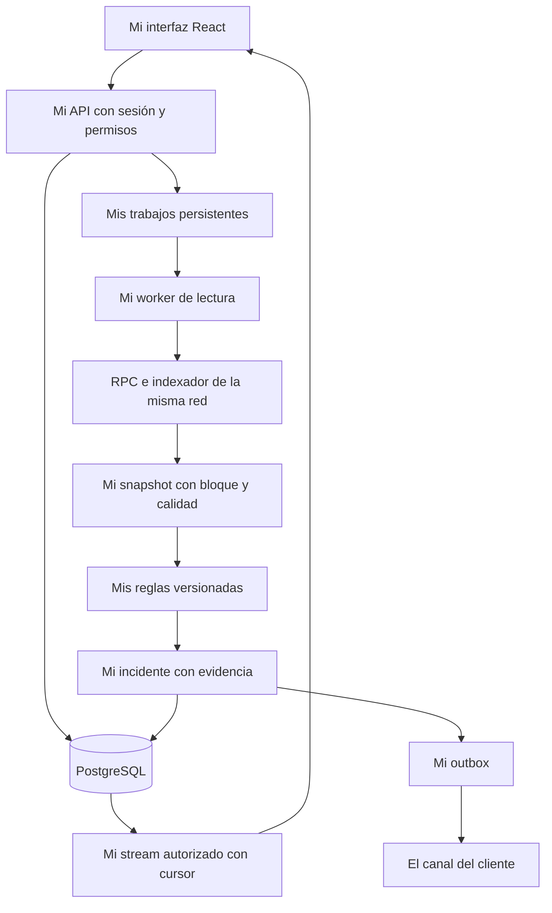
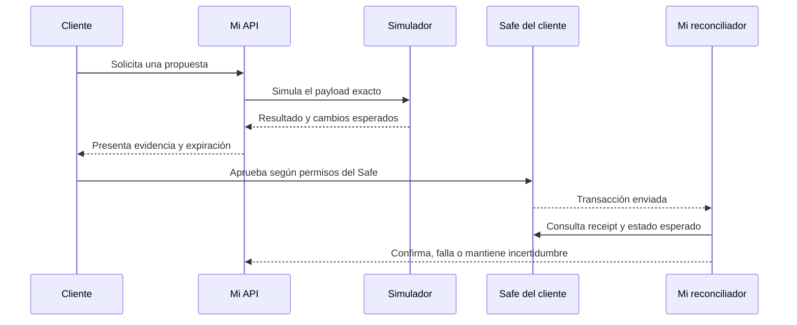

# Mi arquitectura objetivo

Fecha: 3 de octubre de 2026. Describo un diseño propuesto, todavía no implementado.

## Mi decisión

Construyo un monolito modular FastAPI, una app React/Vite, PostgreSQL y un worker separado. Comienzo con lectura de Aave V3 en Ethereum mainnet, por cercanía con la ingestión existente. Reviso la red con los primeros clientes.

No agrego Redis, Kubernetes ni otros microservicios sin necesidad medida. En el MVP no despliego WDK ni doy seed o permisos de firma al worker.

## Mi flujo

## Mis módulos y contratos

Defino identidad; ingestión; dominio de posiciones; evaluación; trabajos; notificaciones; explicación opcional e interfaz. El dominio no depende de HTTP y la evaluación no autoriza dinero mediante texto.

Identifico cuentas por chain_id y address normalizada. En cada snapshot guardo organización, cadena, cuenta, mercado, protocolo, bloque/hash, observed_at, ingested_at, proveedor, versión de esquema, completeness y freshness. Separo FRESH, STALE, PARTIAL y UNAVAILABLE.

Uso importes enteros en unidades base y Decimal para cálculos; convierto únicamente al presentar. Identifico activos por red y contrato, no símbolo.

En cada alerta registro snapshot, regla/versión, política/versión, umbral, valores que la activaron, severidad y estado. No confundo calidad de datos con probabilidad de riesgo.

Leo getUserAccountData y reservas Aave a un bloque consistente. Trato deuda cero como health factor no aplicable a liquidación, no como una seguridad absoluta. Considero E-mode, parámetros, decimales y oráculos al implementar.

## Mi persistencia

Creo migraciones para organizations, users, memberships, sessions, monitored_accounts, protocol_positions, position_snapshots, policies, policy_versions, rule_versions, incidents, alerts, incident_events, jobs, notification_destinations, notification_outbox y audit_events.

Incluyo organization_id en datos privados y constraints/referencias que impidan mezclar organizaciones. Indexo tiempo, estado, cuenta y próxima ejecución. Distingo eventos auditables de logs técnicos y redacto información sensible.

Exijo DATABASE_URL de PostgreSQL en producción. No acepto fallback temporal allí ni uso create_all como sistema de migraciones.

## Mi worker y recuperación

Creo jobs con available_at, attempts, lease_owner, lease_expires_at y status. Reclamo con transacción y bloqueo PostgreSQL, recupero leases y limito retries con backoff/jitter.

Uso checkpoints por cadena/cuenta. Si cambia block_hash por reorg, invalido derivados y reconstruyo desde un bloque seguro; conservo la trazabilidad de correcciones.

Deduplico incidentes por organización, cuenta, regla y episodio. Uso histéresis, escalamiento y silencio explícito. Escribo outbox junto con alerta en la misma transacción. Evito prometer exactly-once entre sistemas externos; preparo idempotencia de destino y tolero reintentos.

Persisto eventos para SSE con cursor, autorización y buffers acotados. Reanudar un stream no inicia evaluación económica.

## Mi autenticación

Uso sesiones HttpOnly/Secure, vencimiento y revocación; invitaciones y roles owner/operator/viewer. Para login por wallet verifico nonce de un solo uso, dominio, URI, red y expiración; incorporo EIP-1271 cuando corresponda.

Una firma no concede acceso a una organización ajena ni permisos sobre una cuenta observada. Valido membresía en consultas, exportaciones, jobs y eventos.

Limito CORS a orígenes configurados y protejo cookies con SameSite y CSRF según el flujo. No pongo claves compartidas en VITE_*.

## Mi API propuesta

| Ruta | Resultado que diseño |
|---|---|
| POST /api/v1/analyses | Creo trabajo de lectura con cuota e idempotencia |
| GET /api/v1/analyses/{id} | Devuelvo resultado y calidad |
| POST /api/v1/accounts | Agrego cuenta autorizada |
| GET /api/v1/accounts y /positions | Listo recursos de la organización |
| POST /api/v1/policies | Creo versión de política |
| GET /api/v1/incidents | Pagino incidentes |
| POST /api/v1/incidents/{id}/acknowledgements | Registro seguimiento |
| GET /api/v1/events | Reanudo por cursor autorizado |
| GET /health/live y /health/ready | Indico vida y readiness sin datos de clientes |

Migro aliases heredados con fecha de retiro. Todos los GET son lectura.

## Mi etapa futura de propuestas

Preparo guía manual o propuesta para un Safe del cliente, con proposer autorizado y aprobación de propietarios. No comienzo con un módulo que pueda gastar autónomamente.

Vinculo payload exacto, cadena, nonce, política, simulación y expiración. Mostrar una propuesta no equivale a firmar, enviar o confirmar. No preparo una acción para una posición que la cuenta ejecutora no puede gestionar.

Si implemento ejecución, diseño identidad de intención con organización, cadena, cuenta ejecutora, nonce/identificador semántico, política, versión y acciones ordenadas. Mantengo bloque como evidencia y vigencia, sin convertir cada poll en una intención nueva.

Persisto intención, payload firmado/hash antes de broadcast cuando sea posible. Si el proveedor ya transmitió antes de devolver hash, reconcilio la ventana incierta por payload/nonce/hash. No prometo eliminarla escribiendo el hash después.

No llamo ATOMIC a pasos secuenciales irreversibles. Uso lote con reversión real o estados parciales. Verifico receipt, cadena y cambio esperado; un hash solo significa enviado.

## Mi operación

Publico frontend, API, worker y Postgres de forma coherente; retiro --reload y web legacy. Uso secretos mínimos por servicio, TLS, readiness y logs estructurados.

Mido cobertura, freshness, lag de jobs, detección, entrega y costo por organización. Pruebo backup/restore y rollback antes de ofrecer SLA.

Consulté [Aave Pool](https://aave.com/docs/aave-v3/smart-contracts/pool?language=en), [Safe Transaction Service](https://docs.safe.global/core-api/transaction-service-overview) y [permisos de proposers](https://help.safe.global/articles/1671337645-proposers). Verifico redes, contratos y versiones al implementar.
