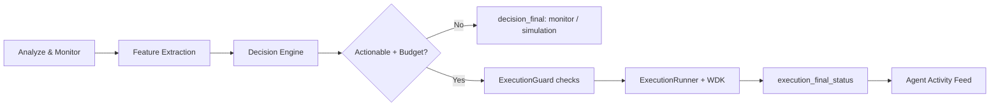

# Autonomous Financial Agent Dashboard

## Conceptual Roles

- **Target Wallet**: analyzed wallet, read-only.
- **Agent Wallet**: execution wallet, uses funded budget.
- **Action Scope**: target wallet is never directly executed.

## API Surface

- `GET /run-agent/{wallet}`: SSE stream for analysis, decision and execution.
- `GET /events/sse/{wallet}` and `GET /events/sse?wallet=...`: SSE aliases.
- `GET /report/{wallet}`: full free analysis snapshot.
- `GET /analyze/wallet/{wallet}`: wallet-level strategic analysis.
- `GET /analyze/block/{block_number}`: block-level strategic analysis.
- `POST /agent/execute`: trigger autonomous execution evaluation for a target wallet.
- `POST /agent/budget`: register verified funding tx for agent budget.
- `GET /agent/budget/{wallet}`: budget for a target wallet context.
- `GET /agent/actions`: recent autonomous executions and value moved.
- `GET /agent/state`: global state, metrics and last action.
- `POST /track-wallet`: add/update wallet in autonomous loop tracking.

## SSE Context Fields

Each event includes:

- `source`
- `agent_wallet`
- `action_scope`
- `decision_context`

Finalization guarantee:

- `decision_final` or `execution_final_status`.

## UI Panels

- **WalletContextPanel**: target wallet vs executor wallet vs balance source.
- **AgentTimeline**: append-only stream by phase and source.
- **AnalysisDashboard**: metrics, behaviors, risk factors and reasoning.
- **ResultsPanel**: decision context and action scope.
- **AgentSummaryCard**: fast narrative of decision and intent.
- **AgentTreasuryCard**: budget and funding.
- **AgentActivityFeed**: autonomous action history.

## Safety

Execution path is unchanged:

ExecutionGuard -> ExecutionRunner -> WDK

Guarantees:

- idempotency
- cooldown
- nonce validation
- exposure validation
- wallet lock
- semaphore concurrency limit

## Runtime Flow

