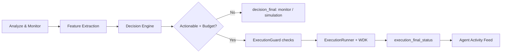

# Autonomous Financial Agent Dashboard

## Conceptual Roles

- **Target Wallet**: analyzed wallet, read-only.
- **Agent Wallet**: execution wallet, uses funded budget.
- **Action Scope**: target wallet is never directly executed.

## Product Narrative

Analyze source -> Learn signal -> Select strategy -> Move agent capital -> Learn outcome

## API Surface

- `GET /run-agent/{wallet}`: SSE stream for analysis, decision and execution.
- `GET /events/sse/{wallet}` and `GET /events/sse?wallet=...`: SSE aliases.
- `GET /report/{wallet}`: full free analysis snapshot.
- `GET /analyze/wallet/{wallet}`: wallet-level strategic analysis.
- `GET /analyze/block/{block_number}`: block-level strategic analysis.
- `POST /agent/execute`: trigger autonomous execution evaluation for a target wallet.
- `POST /agent/budget`: register verified funding tx for agent budget.
- `GET /agent/budget/{wallet}`: budget for a target wallet context.
- `GET /agent/actions`: recent autonomous executions and value moved.
- `GET /agent/state`: global state, metrics and last action.
- `GET /agent/learning`: learning summary of signals and outcomes.
- `GET /agent/radar`: prioritized tracked wallets for autonomous loop.
- `POST /track-wallet`: add/update wallet in autonomous loop tracking.

## SSE Context Fields

Each event includes:

- `source`
- `agent_wallet`
- `action_scope`
- `decision_context`
- `signal_detected`
- `strategy_selected`
- `simulation_passed`
- `execution_submitted`
- `execution_value`
- `execution_verified`

Finalization guarantee:

- `decision_final` or `execution_final_status`.

## UI Panels

- **WalletContextPanel**: target wallet vs executor wallet vs balance source.
- **AgentTimeline**: append-only stream by phase and source.
- **AnalysisDashboard**: metrics, behaviors, risk factors and reasoning.
- **ResultsPanel**: decision context and action scope.
- **AgentSummaryCard**: fast narrative of decision and intent.
- **AgentTreasuryCard**: budget and funding.
- **AgentActivityFeed**: autonomous action history.
- **AgentIntelligenceFeed**: detected on-chain signals and confidence.
- **StrategyEnginePanel**: selected strategy and rationale.
- **WalletRadarPanel**: tracked wallet priority queue.
- **AgentFundingPanel**: MetaMask one-click funding, tx confirmation states, and activation sync.

Hero-first summary:

- Agent balance
- Last action executed
- Approximate PnL
- Autonomous runtime status

## Safety

Execution path is unchanged:

ExecutionGuard -> ExecutionRunner -> WDK

Guarantees:

- idempotency
- cooldown
- nonce validation
- exposure validation
- wallet lock
- semaphore concurrency limit

Demo behavior:

- `AGENT_DEMO_MODE=true` increases execution frequency with low-risk micro actions.
- ESL remains mandatory even in demo mode.

## Funding Lifecycle

1. User clicks **Fund Agent** in AgentFundingPanel.
2. MetaMask signs and submits transaction to Agent Wallet.
3. Frontend registers tx hash in `POST /agent/budget`.
4. UI polls `/agent/state` every 3 seconds for balance increase and only confirms after real delta.
5. On funds received, UI marks autonomous execution as activated and triggers execution for selected wallet.
6. In demo mode, backend triggers immediate bootstrap execution when successful executions are still zero.

## Runtime Flow

